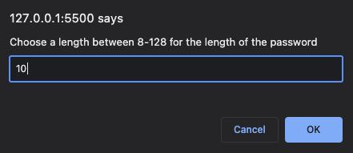

# Password Generator

## Description

- A web application that will create a password based on prompts provided to user.
- Prompts: 
    - length of the password
    - whether to include lowercase, uppercase, numeric or special type characters

## Table of Contents (Optional)

- [Usage](#usage)
- [Credits](#credits)

## Usage

Below is a screenshot of the password generator and the navbar at the top right that will link to the corresponding section when clicked.

Prompts to create the password:
Length of password:

Whether to include lowercase character types:

Whether to include upper character types:

Whether to include numeric character types:

Whether to include special character types:

## Credits

https://developer.mozilla.org/en-US/docs/Web/JavaScript/Reference/Global_Objects/isNaN